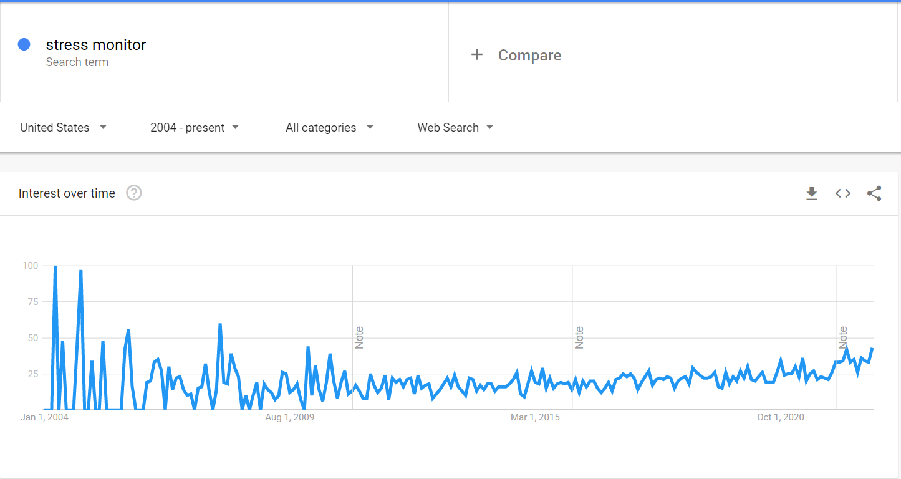

## Table of Contents

### Real-Time Stress Management
- Identifying Stress
- Measuring Stress
- How can Bellabeat beat stress?

------

## Identifying Stress

### What Bellabeat does now?
The Bellabeat app implements a stress-prediction feature where it factors in 
recent sleep habits, activity, menstrual cycle, and time spent with the provided
breathing and meditation exercises to determine stress resistance. 

### What does the competition do?
Other smart watch brands, such as FitBit, uses heart rate variability, exertion,
and sleep data to measure stress.

According to conclusion within published journal, [Stress and Heart Rate Variability: A Meta-Analysis and Review of the Literature](https://www.ncbi.nlm.nih.gov/pmc/articles/PMC5900369/), evidence 
suggests that HRV, heart rate variability, is impacted by stress. Therefore, 
measuring HRV can be used to indicate when a user is stressed.

To better identify stressful events, we define as the following:

1. Heart rate is over 100 BPM
2. No physical activity during recorded period

------

## Measuring Stress

### Environment Setup

I will be using the following libraries: 

- `dplyr`: for analyzing the data
- `timetk`: for summarizing data by hourly intervals
- `ggplot2`: for visualizations

```{r}
#install.packages("dplyr", quiet = TRUE)
library(dplyr)
#install.packages("timetk", quiet = TRUE)
library(timetk)
#install.packages("ggplot2", quiet = TRUE)
library(ggplot2)
```

-----

### Data Used

I will be using the [FitBit Fitness Tracker Data](https://www.kaggle.com/datasets/arashnic/fitbit). 
This data set contains personal fitness tracker metrics from thirty FitBit users
with data point intervals ranging from daily to seconds.

This project's scope will only involve:

- `heartrate_seconds_merged`: a user's heart rate measured in BPM (beats per
minute) recorded in 5-second intervals for 30 days from 3 users
- `hourlyIntensities_merged`: intensity is measured by metabolic equivalents 
(MET)
    + When the user is at rest, FitBit uses a level of 1 MET
    + When the user is performing an activity of moderate intensity, FitBit uses
    a level of 3 MET

```{r}
hr <- read.csv("data/heartrate_seconds_merged.csv")
hourly_intensities <- read.csv("data/hourlyIntensities_merged.csv")
```

-----

### Explore The Data

Heart Rate - 5 second intervals

```{r}
head(hr)
n_distinct(hr$Id)
nrow(hr)
```

Even though we only have `r n_distinct(hr$Id)` unique users (half the data set),
we have `r nrow(hr)` data points to work with.

Activity Intensities - 1 hour intervals

```{r}
head(hourly_intensities)
n_distinct(hourly_intensities$Id)
```

To simplify the analysis, we will only look at the average hourly BPM and 
intensity.

-----

#### Reformat dates

The dates between the 2 data sets are in different formats, so we standardize 
to format, using 24 hours: Month/Day/Year Hour:Minute:Second

```{r}
hr$Time <- as.POSIXct(hr$Time,
                      format = '%m/%d/%Y %H:%M:%S %p')
head(hr)

hourly_intensities$ActivityHour <- as.POSIXct(hourly_intensities$ActivityHour,
                      format = '%m/%d/%Y %H:%M:%S %p')
head(hourly_intensities)
```

-----

### Transform Data

Now that the data is cleaned up and standardized, we will be combining the heart
rate and intensity data into one data set for our analysis.


#### Consolidate Heart Rate Data

As mentioned before, we will only look at average hourly BPM.

```{r}
hr_sum <- hr %>% 
  group_by(Id) %>% 
  summarize_by_time(
    .date_var = Time,
    .by = "hour",
    Value = mean(Value)
  )

head(hr_sum)
```

-----

### Understanding Consolidated Heart Rate Data

Let's see what our average hourly BPM data looks like.

```{r}
ggplot(data = hr_sum) +
  geom_point(mapping = aes(x = Time, y = Value, color = as.factor(Id))) +
  geom_smooth(aes(x = Time, y = Value))
```

Heart rates seem to be within 60 to 100 BPM, averaging 75 BPM between April 12 
and May 12. There are definitely times where BPM is over 100 -- this is probably
where stressful events come in.

-----

#### Join Heart Rate With Hourly Intensity Data

We will now combine the consolidated heart rate data with the intensity data to 
correlate intensity with heart rate. 

```{r}
hr_int <- merge(hr_sum, 
                hourly_intensities, 
                by.x = c("Id", "Time"), 
                by.y = c("Id", "ActivityHour"))

head(hr_int)
```

-----

#### Consolidate Merged Data By The Hour

Since there are some entries with multiple intensity data points within the same
hour, we will average these values out to have a single average intensity per 
hour to match with our consolidated heart rate data.

From there, we will filter out the data to include average hourly BPM measured 
at 100 or higher and MET measured at 1 or lower. This is how we will measure a 
stressful event.

```{r}
hr_int_sum <- hr_int %>% 
  filter(Value >= 100 & AverageIntensity <= 1) %>% 
  select(Id, Time, Value, AverageIntensity) %>% 
  group_by(Id) %>% 
  summarize_by_time(
    .date_var = Time,
    .by = "hour",
    Value = mean(Value)
  )

hr_int_sum$Time <- format(as.POSIXct(hr_int_sum$Time), format = '%H')

head(hr_int_sum)
```

-----

### The Most Common Hour Where Stress Occurs

```{r}
ggplot(hr_int_sum, mapping = aes(x = Time)) +
  geom_bar() +
  ggtitle("Which hour has the most stressful events?") +
  xlab("Hour of Day") +
  ylab("Stressful Events")
```
With this chart, we can speculate that 9 AM records the most stressful events 
for users -- meaning, the user experiences a higher heart rate at rest. This is 
probably due to users first coming into work and trying to get settled.

-----

## Conclusion

To add to the stress management functionality within the Bellabeat app, consider
implementing heart rate monitoring to measure HRV and stress events real-time. 
This can work alongside with stress level predictions. 

An article from PC mag reviewed the Bellabeat Leaf and mentioned how it expected
real-time stress management:

*Because I was expecting real-time stress evaluation based on my breathing, I was a little disappointed at first. But as I spent more time with the app, I realized I am pretty happy with how it's all set up. This is just a prediction tool, and because I can see the different values that are affecting my stress resistance, I can make positive changes before I get too overwhelmed. The flip side of that coin is that I can be aware of those days when I might need to make a conscious effort to extend myself and my family a little extra grace.*

Source: [How the Bellabeat Leaf Urban Can Help You Manage Stress](https://www.pcmag.com/news/how-the-bellabeat-leaf-urban-can-help-you-manage-stress)

This shows that Bellabeat should not stop at stress prediction, but find a way 
to implement real-time stress monitoring.

According to Google Trends, the keywords "stress monitor" is starting to trend 
and Bellabeat can take advantage of this opportunity.



Since the pandemic in 2020, mental health has been a hot topic so providing 
stress management tools that predict stress and monitor it real-time is important. 
This would align with Bellabeat's philosophy for practicing mindfulness. 

-----

### Immediate Action Steps

With the Bellabeat app's feature of predicted stress management, this data can 
be used to push notifications to practice mindfulness when they first start work. 
This daily check-up would improve user stress levels and well-being. Provide this 
functionality with the membership as a method of monetization.

-----

### Future Action Steps

Add a heart rate sensor to start monitoring BPM and measure HRV to stay 
competitive. Bellabeat can use its current edge with stress management to 
enhance its functionality with this.

Using metrics provided with stress-management, apply HRV to correlate with 
stressful events in real-time. Send a notification to the user during times of 
stress to practice breathing exercises and mindfulness activities and reward the
user for increased stressed management. 